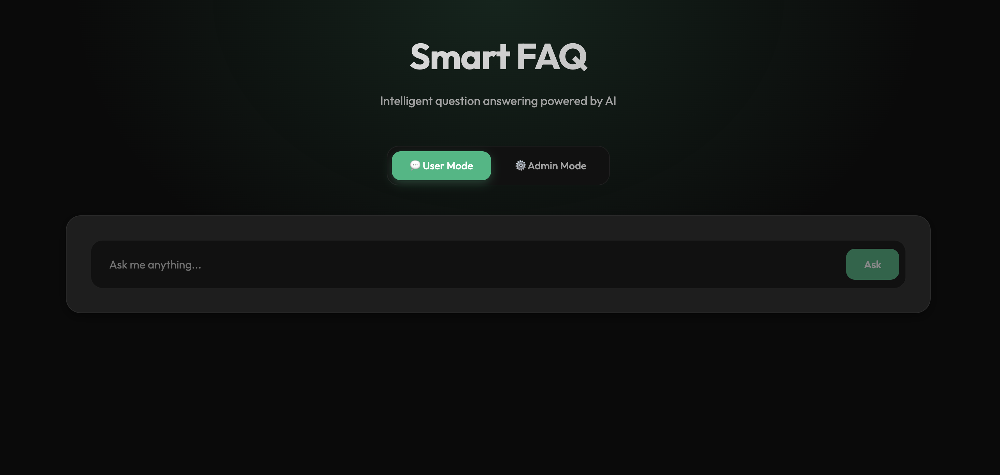
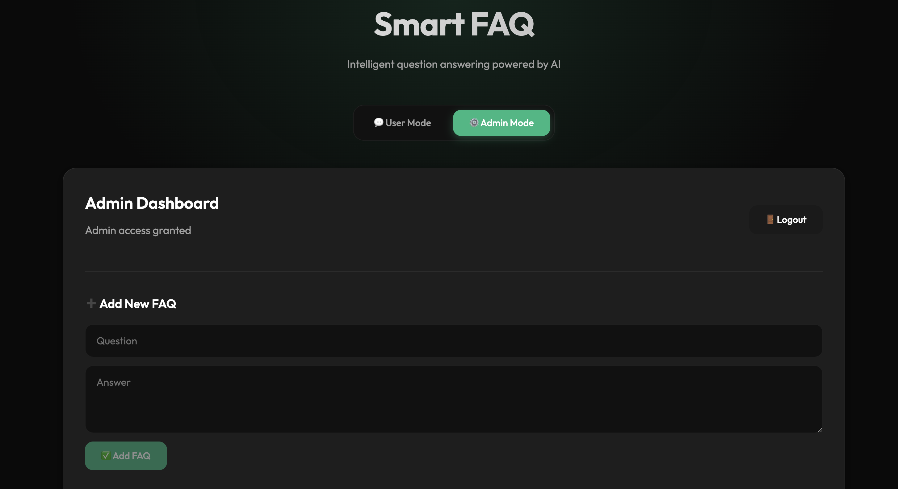
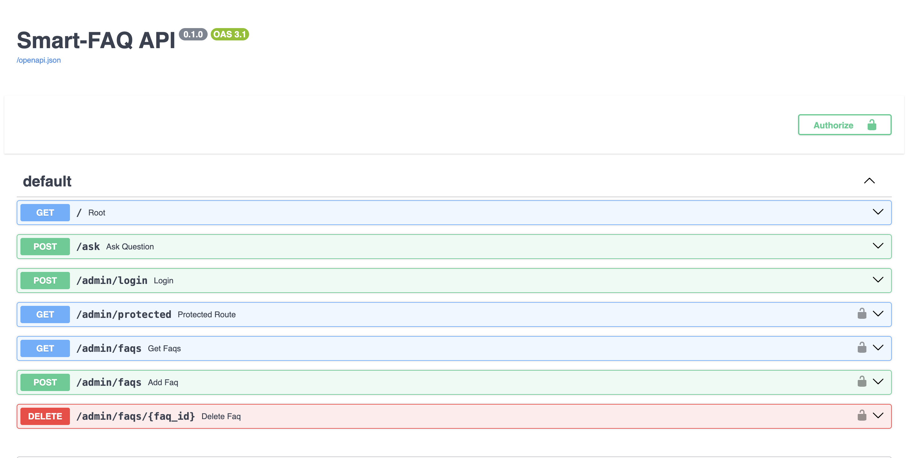

# 🧠 Smart-FAQ

> **Full-stack AI semantic search platform with admin dashboard, JWT authentication, and MongoDB integration.**

AI-powered semantic FAQ system built with **FastAPI, React, MongoDB, and SentenceTransformers**.
Instead of keyword matching, Smart-FAQ understands the *meaning* of a question using embeddings and returns the most relevant answer with a confidence score.

---

## 🚀 Overview

Smart-FAQ is a modern full-stack AI application that enables users to ask natural-language questions and receive intelligent responses from a semantic FAQ database.

The system includes:

* ⚡ FastAPI backend
* 🎨 React frontend (Vite)
* 🔐 JWT-based admin authentication
* 🧠 Semantic search using embeddings
* 🍃 MongoDB database

Admins manage FAQs through a protected dashboard, while users interact with a clean AI-powered interface.

---

## ✨ Features

* Semantic question matching (embedding-based)
* Confidence score with each response
* Low-confidence fallback handling
* Secure admin dashboard (Add/Delete FAQs)
* JWT-protected API routes
* MongoDB-powered storage
* Responsive glass-style UI

---

## 🧠 Architecture

```
React Frontend
        ↓
FastAPI Backend
        ↓
Embedding Model (SentenceTransformers)
        ↓
MongoDB Database
```

**Flow**

1. User sends question from React UI
2. FastAPI generates embeddings
3. MongoDB FAQs are compared semantically
4. Best match + confidence score returned

Embedding Model:
`all-MiniLM-L6-v2`

---

## 🛠 Tech Stack

### Frontend

* React (Vite)
* Fetch API
* Modern CSS (Glass-style UI)

### Backend

* FastAPI
* Uvicorn
* SentenceTransformers
* PyTorch
* JWT Authentication

### Database

* MongoDB

---

## ⚙️ Setup Instructions

### 🔧 Backend Setup

```bash
cd backend
pip install -r requirements.txt
```

Start MongoDB locally.

Seed demo data:

```bash
python seed_db.py
```

Run backend:

```bash
uvicorn app:app --reload
```

API Docs:

```
http://127.0.0.1:8000/docs
```

---

### 🎨 Frontend Setup

```bash
cd frontend/smartfaq-frontend
npm install
npm run dev
```

Frontend runs at:

```
http://localhost:5173
```

---

## 🔌 API Endpoints

### Public

* `GET /` — Health check
* `POST /ask` — Semantic question endpoint

### Admin (JWT Protected)

* `POST /admin/login`
* `GET /admin/faqs`
* `POST /admin/faqs`
* `DELETE /admin/faqs/{faq_id}`

---

## 🔐 Admin Access

Admin authentication uses JWT tokens.

Login via Admin Mode UI or:

```
POST /admin/login
```

Token is required for protected routes.

---

## 🌱 Seed Database

Populate MongoDB with demo FAQs:

```bash
python seed_db.py
```

Loads data from:

```
backend/data/seed_faqs.json
```

---

## 📸 Screenshots

### User Interface



### Admin Dashboard



### API Documentation



---

## 🎯 Future Improvements

* Vector database integration
* Role-based admin permissions
* FAQ categories & filtering
* Docker deployment

---

## 📄 License

MIT License

---

## 👤 Author

**Hariharan Narlakanti**
