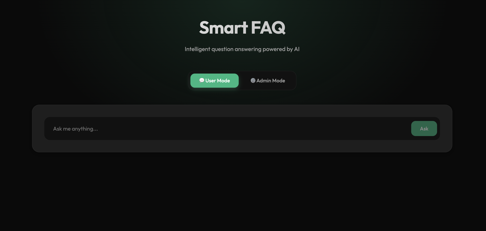
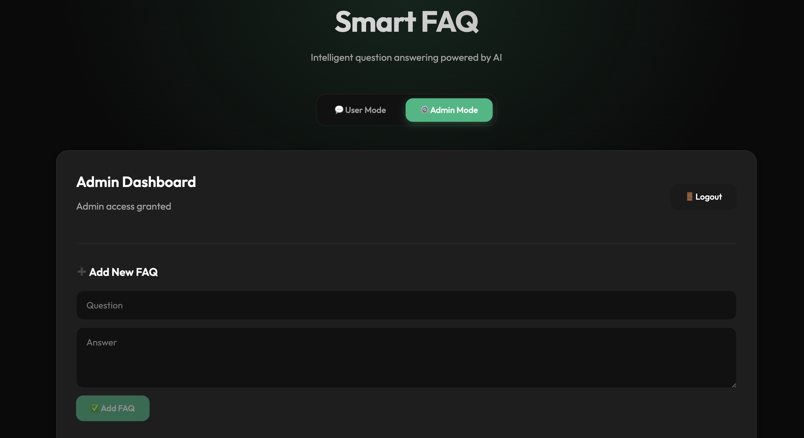
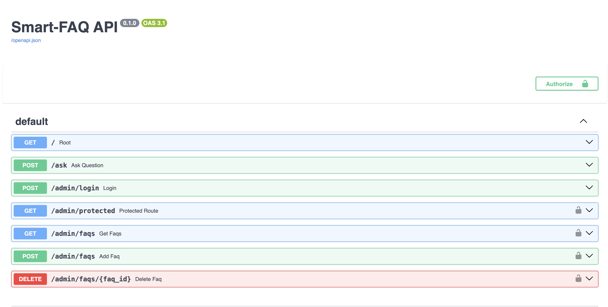

# 🧠 Smart-FAQ

> **AI-powered semantic FAQ platform with FastAPI, React, MongoDB, and JWT authentication.**

Smart-FAQ is a full-stack AI application that allows users to ask natural-language questions and receive intelligent responses using semantic similarity instead of traditional keyword matching.

Built using **FastAPI, React, MongoDB, and SentenceTransformers**, the system analyzes the meaning of user queries through embeddings and returns the most relevant FAQ answer with a confidence score.

---

## 🚀 Overview

The platform consists of:

* ⚡ FastAPI backend
* 🎨 React frontend (Vite)
* 🔐 JWT-based admin authentication
* 🧠 Semantic search with embeddings
* 🍃 MongoDB integration

Admins can manage FAQs through a protected dashboard, while users interact with a clean AI-powered search interface.

---

## ✨ Features

* Semantic FAQ search using embeddings
* Confidence score for responses
* Fallback handling for low-confidence matches
* Secure admin dashboard for FAQ management
* JWT-protected admin APIs
* MongoDB-based storage
* Responsive modern UI

---

## 🧠 Architecture

```text
React Frontend
        ↓
FastAPI Backend
        ↓
SentenceTransformer Embeddings
        ↓
MongoDB Database
````

### Request Flow

1. User submits a question from the frontend
2. FastAPI generates embeddings for the query
3. Stored FAQ embeddings are compared semantically
4. Best-matching answer and confidence score are returned

### Embedding Model

```text
all-MiniLM-L6-v2
```

---

## 🛠 Tech Stack

### Frontend

* React (Vite)
* Fetch API
* Modern CSS UI

### Backend

* FastAPI
* Uvicorn
* SentenceTransformers
* PyTorch
* JWT Authentication

### Database

* MongoDB

---

## ⚙️ Setup Instructions

### 🔧 Backend Setup

```bash
cd backend
pip install -r requirements.txt
```

Start MongoDB locally.

Seed demo FAQ data:

```bash
python seed_db.py
```

Run the backend server:

```bash
uvicorn app:app --reload
```

API Documentation:

```text
http://127.0.0.1:8000/docs
```

---

### 🎨 Frontend Setup

```bash
cd frontend/smartfaq-frontend
npm install
npm run dev
```

Frontend URL:

```text
http://localhost:5173
```

---

## 🔌 API Endpoints

### Public Routes

* `GET /` — Health check
* `POST /ask` — Semantic question answering

### Admin Routes (JWT Protected)

* `POST /admin/login`
* `GET /admin/faqs`
* `POST /admin/faqs`
* `DELETE /admin/faqs/{faq_id}`

---

## 🔐 Authentication

Admin access is secured using JWT authentication.

Admins can log in through the admin UI or using:

```text
POST /admin/login
```

JWT tokens are required for protected admin routes.

---

## 🌱 Seed Database

Populate MongoDB with sample FAQs:

```bash
python seed_db.py
```

Data source:

```text
backend/data/seed_faqs.json
```

---

## 📸 Screenshots

### User Interface



### Admin Dashboard



### API Documentation



---

## 🎯 Future Improvements

* Vector database integration
* Role-based access control
* FAQ categorization and filtering
* Docker deployment support
* Multi-language support

---

## 📄 License

MIT License

---

## 👤 Author

**Hariharan Narlakanti**
